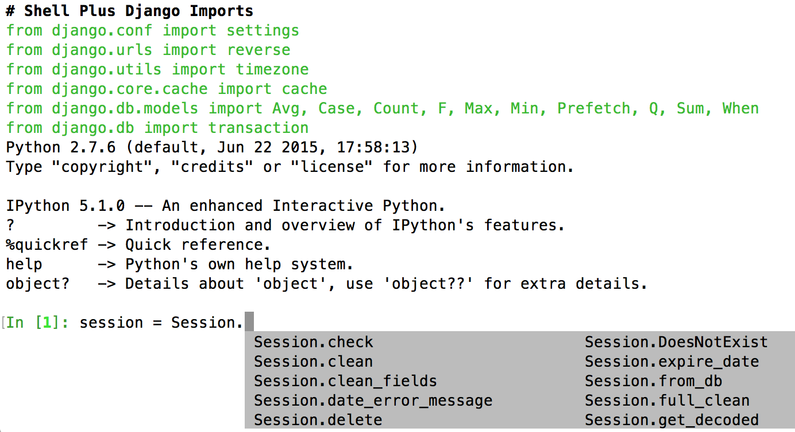

theme: Next, 0
slidenumbers: true

## Things I've Learned from Being Thrown Into Python and Django
### _Ryan Scott_

---

# Introduction

- Software Engineer @ Percipient Networks
- Former Node.js and Salesforce developer
- Several years using Python and Django for fun
- 2 months using Python and Django professionally

---

# Problem:
## How do you quickly find the documentation of an object?

---

# Python Standard Library: `help()`

- Print the help text for a module, function, class, method, keyword, etc.
- This is why we write documentation!
- Stay in the terminal, no need to use Google
- Also check out `dir()`

---

# Python Standard Library: `help()`

```
>>> import requests
>>> help(requests)
Help on package requests:
...
DESCRIPTION
    requests HTTP library
    ~~~~~~~~~~~~~~~~~~~~~
    
    Requests is an HTTP library, written in Python, for human beings. Basic GET
    usage:
    
       >>> import requests
       >>> r = requests.get('https://www.python.org')
       >>> r.status_code
       200
       >>> 'Python is a programming language' in r.content
       True
...
```

---

# Problem:
## How do you easily initialize a dictionary?

```python
>>> colors = ['yellow', 'blue', 'red', 'blue',
              'blue', 'yellow', 'green', 'red', 'yellow']

>>> color_count = {}
>>> for color in colors:
...     if color not in color_count:
...         color_count[color] = 1
...     else:
...         color_count[color] += 1
>>> color_count
{'blue': 3, 'green': 1, 'red': 2, 'yellow': 3}
```

---

# Python Standard Library: `defaultdict`

- Solves the common problem of having to initialize a dictionary before using it
- Only saves a couple lines of code, but this can be huge for readability in complex loops!

---

# Python Standard Library: `defaultdict`

```python
>>> colors = ['yellow', 'blue', 'red', 'blue',
              'blue', 'yellow', 'green', 'red', 'yellow']

>>> from collections import defaultdict
>>> color_count = defaultdict(int)
>>> for color in colors:
...     color_count[color] += 1
>>> color_count
defaultdict(<type 'int'>, {'blue': 3, 'green': 1, 'red': 2, 'yellow': 3})
```

---

# Problem:
## How do you efficiently iterate over a massive or infinite list?

---

# Generator functions

- Easily iterate through a massive or infinite list
- Avoid pulling the whole list into memory

---

# Generators functions

```python
>>> def fib(max):
...     a, b = 0, 1
...     for i in xrange(max):
...         yield a
...         a, b = b, a + b

>>> for num in fib(10):
...     print num
# Outputs the first 10 Fibonacci numbers
```

---

# Problem:
## How do you make it easy to onboard developers??
### and
## How do you simplify repetitive tasks?

---

# Fabric

- Command-line tool for executing local and remote shell commands
- Don't Repeat Yourself for development tasks
- Make development easy! (Especially when using a virtual machine)

---

# Fabric example #1

Reset your development database:

```python
@task
def db_reset(db_name="dashboard"):
    """Delete and recreate the database."""
    drop(db_name)
    create()
    createcachetable()
    migrate()
    load_fixture_data()
    createinitialrevisions()
```

```bash
$ fab dev db_reset
# Database data has been reset
```

---

# Fabric example #2

```python
@task
def runserver():
    """Run the Django runserver command which autoreloads on file changes."""
    with common.setup_venv(), common.no_prefix():
        run('python manage.py runserver_plus')
```

```bash
$ fab dev runserver
# Calls 'python manage.py runserver_plus' on dev environment

$ fab staging runserver
# Calls 'python manage.py runserver' on staging environment
```

---

# Problem:
## How do you improve developer experience in the shell and when debugging?

---

# Django Extensions

- Collection of custom extensions for Django
- [https://django-extensions.readthedocs.io/](https://django-extensions.readthedocs.io/)
- My favorites:
    - `shell_plus`
    - `runserver_plus`

---

# Django Extensions: `shell_plus`

- Django shell improvement
- Autoloads the app's database models
- Save time, Don't Repeat Yourself!

---

# Django Extensions: `shell_plus`



---

# Django Extensions: `runserver_plus`

- Django `runserver` **plus** the Werkzeug debugger
- Improved traceback page during exceptions
- Adds an interactive debugging console to evaluate code on the server

---

# Django Extensions: `runserver_plus`


# Read the Django source code!

- Django documentation does not include every little detail
- The Django source code is very readable
- Often the best way to figure out how to use a class
- Teaches Django best practices and patterns

---

# Thank you

## [github.com/percipient/talks](https://github.com/percipient/talks)
## ryan@strongarm.io
