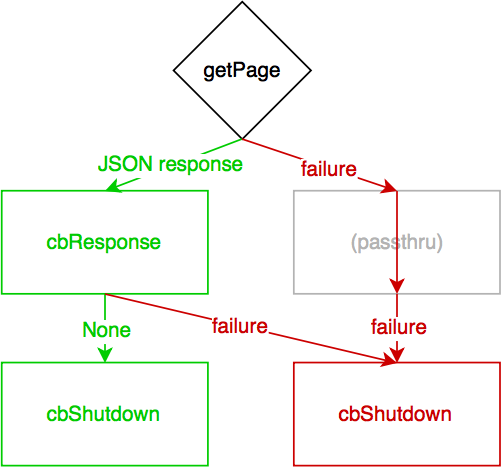

<!---
This is a comment and should not render!
-->

# [fit] twisted
# [fit] _concepts & patterns_

---

# [fit] introduction

---


# [fit] Patrick Cloke

## _lead engineer @ Percipient Networks_
## &
## _mozillian_
## @_clokep_

---


# [fit] Stephen DiCato

## _co-founder & VP, engineering_
## _@ Percipient Networks_
## @_dicato_

---

### _if you Twitter_
## @clokep & @stephendicato

---

# [fit] expectations
## [fit] learn these *5* concepts

---

## 1. what is async

---

## 2. when to async

---
## 3. event loop (reactor)

---

## 4. deferreds

---

## 5. protocols

---

# [fit] expectations
## [fit] *integrate* twisted

---

## use twisted
## to build modern
# [fit] services

---

## **chat server** example (with admin dashboard)

- Clients use netcat
- Messages are broadcast to all users
- Clients are sent a banner on login
- Banner is configurable via an admin webpage

---

(this slide intentionally left blank)

---

## 1. what is async

---

## twisted is...
# [fit] **evented** and *asynchronous*

<!--

Asynchronous: non-blocking against I/O bound tasks (e.g. reading/writing to
a socket). [Jean-Paul Calderone, http://stackoverflow.com/a/6118510/1070085]

Evented: user code is notified by the event loop when something it cares
about happens (e.g. new data is available on a socket). Frequently layered
in Twisted: e.g. new data to new line to new HTTP request.

-->

---

## 2. when to async

---

## when to use it (todo)

<!--

Why use Twisted?
    * Don't worry about low-level networking
    * Easily handle many connections without blocking
    * Built in parsing of many network protocols.

When shouldn't I use Twisted?
    Twisted will not help you with CPU-bound tasks, e.g. long blocking tasks.

    Twisted is probably not the easiest library if you just want to make an HTTP
    request. (I'd suggest using `requests <http://python-requests.org/>`_.)

-->

---

## 3. event loop (reactor)

---

## reactor (todo)

---

## 4. deferreds

---

## [fit] a **deferred** is a *promise*
## [fit] that a function will eventually have a **result**

<!--

Deferreds are similar to "Promises" or "Futures". They are used to process the
results of an asynchronous function: the function returns (a Deferred)
immediately, callbacks are attached that will received the result of the
previous callback.

-->

---


# [fit] deferreds
## [fit] manage a *callback chain*

<!--

The chain of callbacks is processed using the following rules:

1.  Result of the callback is always passed as the first argument to the next
    callback.
2.  If a callback raises an exception, switch to errback.
3.  An unhandled failure gets passed down the line of errbacks, creating an
    asynchronous analog to a series of `except:` statements.
4.  If an errback doesn’t raise an exception or return a
    `twisted.python.failure.Failure` instance, switch to callback.

See http://twistedmatrix.com/documents/current/core/howto/defer.html

-->

---

example



```python
import json

from twisted.internet import reactor
from twisted.web import client

# The Deferred.
d = client.getPage('https://api.github.com/users/clokep/orgs')

def cbResponse(data):
    # Parse the JSON payload. TODO Error checking.
    orgs = json.loads(data)
    # Find the names of the organizations and print them in
    # alphabetical order.
    org_names = sorted([org['login'] for org in orgs])
    print('\n'.join(org_names))
d.addCallback(cbResponse)  # The callback for a successful request.

def cbShutdown(ignored):
    reactor.stop()  # No matter what happens, shutdown the eventloop.
d.addBoth(cbShutdown)  # The callback/errback.

reactor.run()  # Start the eventloop.
```

---

## 5. protocols

---

## protocols

---

## trial
# [fit] testing, the twisted way

---

## integrate twisted with other services

---

## persisting data out of a twisted service

---
