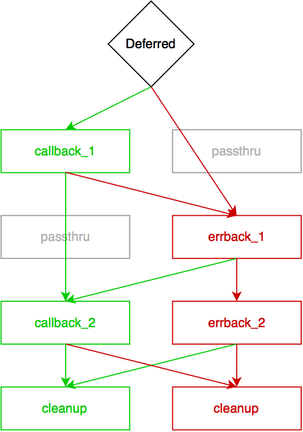

<!---
This is a comment and should not render!
-->

# twisted
## _concepts & patterns_

---

# introduction

---


# [fit] Patrick Cloke

## _lead engineer @ Percipient Networks_
## &
## _mozillian_
## _github.com/clokep_

---


# [fit] Stephen DiCato

## _co-founder & VP, engineering_
## _@ Percipient Networks_
## _github.com/dicato_

---

### _if you Twitter_
## @clokep & @stephendicato

---


<!---
We are a local cybersecurity startup. If you are interested in security, come
and talk to us after the talk or checkout out strongarm.io.
-->

---

# **questions**
# welcome

---

# **expectations**
## learn these *6* concepts

---

## 1. what is twisted

---

## 2. when/why to use twisted

---
## 3. event loop (reactor)

---

## 4. deferreds

---

## 5. protocols (and more)

---

## 6. use twisted to build *systems* & *services*

---

## composable & scalable systems

---

## i.e., *service oriented architecture*

---

## i.e., *microservices*

---

# context
## an example app

---

## **chat server** example (with admin dashboard)

- Clients use netcat
- Messages are broadcast to all users
- Clients are sent a banner on login
- Banner is configurable via an admin webpage

---


---


---
(this slide intentionally left blank)

---

## 1. what is twisted

---

## twisted:
## an *event-driven*
## networking engine

<!--

Asynchronous: non-blocking against I/O bound tasks (e.g. reading/writing to
a socket). [Jean-Paul Calderone, http://stackoverflow.com/a/6118510/1070085]

Evented: user code is notified by the event loop when something it cares
about happens (e.g. new data is available on a socket). Frequently layered
in Twisted: e.g. new data to new line to new HTTP request.

-->

---

## example of events (from `chat.py`)

```python
from twisted.internet import protocol


class NetCatChatProtocol(protocol.Protocol):
    def connectionMade(self):
        # Called when the protocol is instantiated &
        # the connection is ready.

    def dataReceived(self, data):
        # New data (bytes) are available for consuming.

    def connectionLost(self, reason):
        # The connection is about to be terminated.
```

---

## 2. when/why to use twisted

---

1. high-level *networking* APIs
1. large protocol library
1. scalable due to asynchronous design
1. mature, with an emphasis on quality

<!--

Built in parsers for many protocols (IMAP, SMTP, IRC, SSH, HTTP, etc.)

Instead of polling a socket, you're told when data is available, etc.

-->

---

# twisted will *not*

* magically make code **non-blocking**
* help with CPU-bound tasks<sup>†</sup>
* be the simplest library to make a simple HTTP request<sup>‡</sup>

<!--

† Unless you want to coiterate, and also have networking tasks, etc.
‡ Although there is treq: requests built on Twisted

-->

---

## 3. event loop (reactor)

---

## event loop APIs:
### *networking, threading, event dispatching, timing, etc.*

<!--

The reactor is the Twisted event loop. The reactor provides APIs for networking,
threading, dispatching events, and more.

-->

---

## reactor depends on
## *platform* and *usage*
### (reactor is a **global singleton**)

<!--

Twisted has event loops that hook into UI event loops (e.g. GTK, wxPython,
win32). Generally, don't change the reactor if you don't need to.

Some functions/methods/classes take in a reactor, this is used for testing and
is not usually provided by client code.

Global singleton: there is only one, ever, it can be accessed everywhere by
importing twisted.internet.reactor.

-->

---

## example (from `runner.py`)

```python
from twisted.internet import reactor, endpoints
from twisted.web import server

from chat import NetCatChatFactory

# Create an instance of the factory.
factory = NetCatChatFactory()

# Listen on TCP port 1400 for chat.
endpoints.serverFromString(reactor, "tcp:1400").listen(factory)

# Start listening for connections (and run the event-loop).
reactor.run()
```

<!--

Note that there are a variety of ways to tell a reactor to listen on a port
using a specific protocol.

-->

---

## 4. deferreds

---

## a **deferred** is a *promise*
### that a function will eventually have a **result**

<!--

Deferreds are similar to "Promises" or "Futures". They are used to process the
results of an asynchronous function: the function returns (a Deferred)
immediately, callbacks are attached that will received the result of the
previous callback.

-->

---

### in other words:
### deferreds are a *placeholder* for a future *result*

<!--

Would it be worth it to discuss deferreds in the context or something like
celery async results?

-->

---

# [fit] deferreds manage a
## [fit] *callback chain*

<!--
Modified version of http://twistedmatrix.com/documents/current/_images/deferred-process.png
-->


<!--

The chain of callbacks is processed using the following rules:

1.  Result of the callback is always passed as the first argument to the next
    callback.
2.  If a callback raises an exception, switch to errback.
3.  An unhandled failure gets passed down the line of errbacks, creating an
    asynchronous analog to a series of `except:` statements.
4.  If an errback doesn’t raise an exception or return a
    `twisted.python.failure.Failure` instance, switch to callback.

Deferreds will automatically print a stacktrace when being garbage collected,
it's usually good practice to explicitly add an errback that logs.

See http://twistedmatrix.com/documents/current/core/howto/defer.html

-->

---

## Example (from `deferred_ex.py`)

```python
import json
from twisted.internet import reactor
from twisted.python import log
from twisted.web import client

def gotOrgs(data):
    print("Organization request done!")
    # Parse the JSON payload. TODO Error checking.
    orgs = json.loads(data)
    # Find the names of the organizations and print them.
    org_names = sorted([org['login'] for org in orgs])
    print('\n'.join(org_names))

def shutdown(ignored):
    print("Shutting down!")
    reactor.stop()  # No matter what happens, shutdown the eventloop.

# The Deferred.
d = client.getPage('https://api.github.com/users/clokep/orgs')
d.addCallback(gotOrgs)  # The callback for a successful request.
d.addErrback(log.err)  # Before shutdown, log any errors.
d.addBoth(shutdown)  # The callback/errback.

reactor.run()  # Start the eventloop.
```

---

## Example Deferred flow (from `deferred_ex.py`)


---

# Demo

---

## Advanced example, part 1. (from `deferred_ex_2.py`)

```python
import json
from twisted.internet import defer, reactor
from twisted.python import log
from twisted.web import client

def gotRepos(data, org):
    pass

def gotOrgs(data):
    pass

def printOrgs(org_list):
    print("Outputting repos")
    for success, (org, repos) in org_list:
        print('\t%s: %s' % (org, ', '.join(repos) if repos else '(none)'))

def shutdown(ignored):
    print("Shutting down!")
    reactor.stop()  # No matter what happens, shutdown the eventloop.

# The Deferred.
d = client.getPage('https://api.github.com/users/clokep/orgs')
d.addCallback(gotOrgs)  # The callback for a successful request.
d.addCallback(printOrgs)
d.addErrback(log.err)  # Before shutdown, log any errors.
d.addBoth(shutdown)  # The callback/errback.

reactor.run()  # Start the eventloop.
```

---

## Advanced example, part 2. (from `deferred_ex_2.py`)

```python
def gotRepos(data, org):
    """Got the repos for an org, return a tuple of (org name, repos)."""
    print("Got repo information for %s" % org)

    # Parse the JSON payload. TODO Error checking.
    repos = json.loads(data)
    if not repos:  # no repos, return early
        return (org, [])
    # The names of the repos in alphabetical order.
    names = sorted([repo['name'] for repo in repos])
    return (org, names)

def gotOrgs(data):
    print("Organization request done!")
    # Parse the JSON payload. TODO Error checking.
    orgs = json.loads(data)
    # The names of the organizations in alphabetical order.
    org_names = sorted([bytes(org['login']) for org in orgs])

    # Now request the repos under each org.
    ds = []
    for org in org_names:
        print("\t%s" % org)  # print out the org
        d = client.getPage('https://api.github.com/orgs/%s/repos' % org)
        d.addCallback(gotRepos, org)  # pass the org name to the callback.
        ds.append(d)

    # Returning a Deferred causes the next callback to wait.
    return defer.DeferredList(ds)
```

---

## Advanced Example Deferred flow (from `deferred_ex.py`)


---

# Demo

---

# deferreds fine print



```python
d = defer.Deferred()
d.addCallback(callback_1)
d.addErrback(errback_1)
d.addCallbacks(callback_2, errback_2)
d.addBoth(cleanup)
```

<!--

Callbacks and errbacks *always* stack with passthrus, adding a callback and an
errback separately don't end up "next" to each other in the callback chain.

-->

---

## 5. protocols (and more)

---

# `Protocols`: event handlers for a *connection*

* Each new connection gets a new `Protocol` **instance**
* Basic events include:
connection opened/closed, data available
* Transforms wire protocol into higher level events
(e.g. **Line** received or **HTTP request** finished)

<!--

Twisted includes protocol implementations for low-level (e.g. line received) and
high-level protocols (e.g. HTTP, IRC, IMAP). Can easily add custom protocols.

Generally refers to TCP, but similar for UDP: a Protocol is an event handler for
UDP datagrams.

-->

---

## Example (from `chat.py`)

```python
from twisted.internet import protocol

class NetCatChatProtocol(protocol.Protocol):
    # An instance of a Protocol exists for each established connection.

    def connectionMade(self):
        # Called when the protocol is instantiated and the connection is ready.

    def dataReceived(self, data):
        # New data (bytes) are available for consuming.

    def connectionLost(self, reason):
        # The connection is about to be terminated.

    # Has a transport property for interacting with the connection.

    # Has a factory property for interacting with the factory that build this.
```

---

## `ProtocolFactory`
### keeps **state** across `Protocols`
### builds `Protocol` instances

<!--

Twisted provides interfaces (via zope.interfaces) for each of the above objects,
they describe the full API available on each.

Might hold expensive calculations that only need to be done once or
configuration information (e.g. SSH keys, login information), or any shared
state across multiple protocols (e.g. channels on an IRC server).

-->

---

## Example (from `chat.py`)

```python
from twisted.internet import protocol

class NetCatChatProtocol(protocol.Protocol):
    # See above.

class NetCatChatFactory(protocol.Factory):
    # By defining `protocol`, the default implementation of
    # `Factory.buildProtocol` will work fine!
    protocol = NetCatChatProtocol

    # State and other variables would be stored on the factory.
```

---

# `Transport`

## a way to **send data**

* Write **bytes** to a connection/datagram
* Close a connection
* Query local/remote addresses
* Do not assume *when* data will be sent
* Usually use built-in instances

<!--

Remember that everything in Twisted is bytes not Unicode!

An address varies based on the type of connection: IPv4, IPv6, UNIX, etc.

-->

---

## Example (from `chat.py`)

```python
from twisted.internet import protocol

class NetCatChatProtocol(protocol.Protocol):
    # An instance of a Protocol exists for each established connection.

    def connectionMade(self):
        # The connection has been established, perform greetings here.
        self.transport.write(self.factory.banner)
```

---

# Demo

---

## integrate twisted with other services

---


---


---

# admin console
1. current user count
2. set banner

---


---


---


---

```python
import json

from twisted.internet import reactor, task
from twisted.python import log
from twisted.web import resource, server


class ApiResource(resource.Resource):
    def __init__(self, chat_factory, *args, **kwargs):
        # This needs a reference to the NetCatChat factory object.
        self.chat_factory = chat_factory

        resource.Resource.__init__(self, *args, **kwargs)
```

---

## user API endpoind

```python
class Users(ApiResource):
    isLeaf = True

    def render_GET(self, request):
        # The user count from server.
        user_count = len(self.chat_factory.clients)
        result = {'users': user_count}

        return json.dumps(result, indent=4, separators=(',', ': ')) + "\n"
```

---

## banner API endpoint

```python
class Banner(ApiResource):
    isLeaf = True

    def _set_banner(self, banner):
        # ... error handling ;-)
        self.chat_factory.banner = bytes(banner)  # unicode to bytes

    def render_GET(self, request):
        # Get the banner.
        result = {'banner': self.chat_factory.banner}
        return json.dumps(result, indent=4, separators=(',', ': ')) + "\n"

    def render_POST(self, request):
        # Set the banner.
        status = "ERROR"
        try:
            content = request.content.read()
            data = json.loads(content)['banner']

            # Make this a Deferred so the function can immediately return.
            d = task.deferLater(reactor, 0.1, self._set_banner, data)
            d.addErrback(log.err)

            status = "SUCCESS"
        except Exception:
          # ... error handling ;-)

        return json.dumps({'status': status})
```

---

## update reactor to expose API

```python
from twisted.internet import reactor, endpoints
from twisted.web import server

from chat import NetCatChatFactory
from api import Root

# Create an instance of the factories.
factory = NetCatChatFactory()
site = server.Site(Root(factory))

# Listen on TCP port 1400 for chat and port 8080 for the API.
endpoints.serverFromString(reactor, "tcp:1400").listen(factory)
endpoints.serverFromString(reactor, "tcp:8080").listen(site)

# Start listening for connections (and run the event-loop).
reactor.run()
```

---

## what about the
## *client code*?

---

# api client code / user count

```python
def get_user_count():
    url = API_URL + '/users/'
    try:
        r = requests.get(url)
    except Exception as e:  # Gotta catch 'em all!
        return None

    result = r.json()
    return result['users']
```

---

# api client code / get banner

```python
def get_banner():
    url = API_URL + '/banner/'
    try:
        r = requests.get(url)
    except Exception as e:  # Gotta catch 'em all!
        return None

    result = r.json()
    return result['banner']
```

---

# api client code / set banner

```python
def set_banner(banner):
    url = API_URL + '/banner/'
    data = json.dumps({'banner': banner})
    try:
        r = requests.post(url, data=data)
    except Exception as e:  # Gotta catch 'em all!
        return None
```

---

## now serve it using
# *flask*

---

```python
app = Flask(__name__)
API_URL = 'http://127.0.0.1:8080'

@app.route("/")
def splash():
    user_count = get_user_count()
    banner = get_banner()
    return render_template('index.html', user_count=user_count, banner=banner)


@app.route('/set_banner/', methods=['POST'])
def banner():
    banner = request.values.get('banner', "")
    set_banner(banner)
    return redirect(url_for('splash'))


if __name__ == "__main__":
    app.run()
```

---

# tangent: `twistd`
`twistd` is a daemon that helps run applications.

`twistd web --wsgi=dashboard.app`

Be careful when running as a service under upstart/systemd/init!

---

# demo

---

## What about data *persistence?*

---


---


---

1. `twisted.enterprise.adbapi`
2. SQL Alchemy
3. Django ORM
...

### careful not to block!

---

## Is there a better, more reusable way?

---


---

### How would you *scale* to many twisted servers?

---

# what to research next

* trial: testing, the twisted way
* inline callbacks: synchronous-looking deferreds in twisted

<!--

Some topics we didn't really have time for, but this is at least some keywords
to look up!

-->

---

## thank you - questions?
## github.com/percipient/talks

patrick@percipientnetworks.com
stephen@percipientnetworks.com

(btw, we are sponsoring DjangoCon! Find us!)
