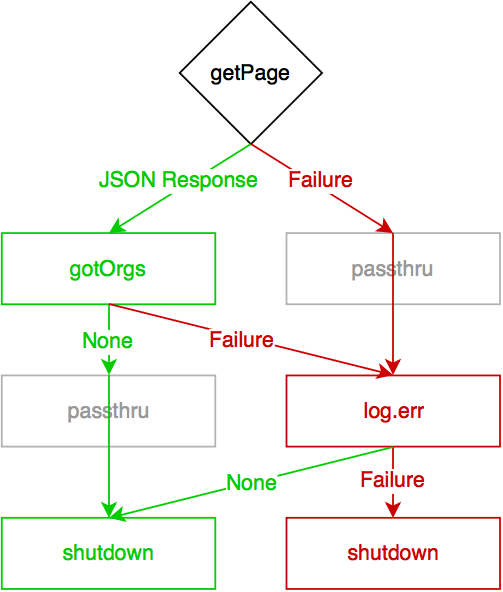

<!---
This is a comment and should not render!
-->

# [fit] twisted
# [fit] _concepts & patterns_

---

# [fit] introduction

---


# [fit] Patrick Cloke

## _lead engineer @ Percipient Networks_
## &
## _mozillian_
## @_clokep_

---


# [fit] Stephen DiCato

## _co-founder & VP, engineering_
## _@ Percipient Networks_
## @_dicato_

---

### _if you Twitter_
## @clokep & @stephendicato

---

# [fit] expectations
## [fit] learn these *5* concepts

---

## 1. what is async

---

## 2. when to async

---
## 3. event loop (reactor)

---

## 4. deferreds

---

## 5. protocols (and more)

---

# [fit] expectations
## [fit] *integrate* twisted

---

## use twisted
## to build modern
# [fit] services

---

## **chat server** example (with admin dashboard)

- Clients use netcat
- Messages are broadcast to all users
- Clients are sent a banner on login
- Banner is configurable via an admin webpage

---

(this slide intentionally left blank)

---

## 1. what is async

---

## twisted is...
# [fit] **evented** and *asynchronous*

<!--

Asynchronous: non-blocking against I/O bound tasks (e.g. reading/writing to
a socket). [Jean-Paul Calderone, http://stackoverflow.com/a/6118510/1070085]

Evented: user code is notified by the event loop when something it cares
about happens (e.g. new data is available on a socket). Frequently layered
in Twisted: e.g. new data to new line to new HTTP request.

-->

---

## 2. when to async

---

## when to use it (todo)

<!--

Why use Twisted?
    * Don't worry about low-level networking
    * Easily handle many connections without blocking
    * Built in parsing of many network protocols.

When shouldn't I use Twisted?
    Twisted will not help you with CPU-bound tasks, e.g. long blocking tasks.

    Twisted is probably not the easiest library if you just want to make an HTTP
    request. (I'd suggest using `requests <http://python-requests.org/>`_.)

-->

---

## 3. event loop (reactor)

---

## [fit] event loop APIs:
### networking, threading, event dispatching, timing, etc.

<!--

The reactor is the Twisted event loop. The reactor provides APIs for networking,
threading, dispatching events, and more.

-->

---

# reactor implementation depends on
# [fit] *platform* and *other factors*
## reactor is a **global singleton**

```python
from twisted.internet import reactor

def add(a, b):
    """Add to variables and return them..."""
    return a + b

delay = 1.0  # seconds
reactor.callLater(delay, add, 8, 3)
```

<!--

Twisted has event loops that hook into UI event loops (e.g. GTK, wxPython,
win32). Generally, don't change the reactor if you don't need to.

Some functions/methods/classes take in a reactor, this is used for testing and
is not usually provided by client code.

Global singleton: there is only one, ever, it can be accessed everywhere by
importing twisted.internet.reactor.

-->

---

## 4. deferreds

---

## [fit] a **deferred** is a *promise*
## [fit] that a function will eventually have a **result**

<!--

Deferreds are similar to "Promises" or "Futures". They are used to process the
results of an asynchronous function: the function returns (a Deferred)
immediately, callbacks are attached that will received the result of the
previous callback.

-->

---


# [fit] deferreds
## [fit] manage a *callback chain*

<!--

The chain of callbacks is processed using the following rules:

1.  Result of the callback is always passed as the first argument to the next
    callback.
2.  If a callback raises an exception, switch to errback.
3.  An unhandled failure gets passed down the line of errbacks, creating an
    asynchronous analog to a series of `except:` statements.
4.  If an errback doesn’t raise an exception or return a
    `twisted.python.failure.Failure` instance, switch to callback.

See http://twistedmatrix.com/documents/current/core/howto/defer.html

-->

---

example



```python
import json

from twisted.internet import reactor
from twisted.web import client

# The Deferred.
d = client.getPage('https://api.github.com/users/clokep/orgs')

def cbResponse(data):
    # Parse the JSON payload. TODO Error checking.
    orgs = json.loads(data)
    # Find the names of the organizations and print them in
    # alphabetical order.
    org_names = sorted([org['login'] for org in orgs])
    print('\n'.join(org_names))
d.addCallback(cbResponse)  # The callback for a successful request.

def cbShutdown(ignored):
    reactor.stop()  # No matter what happens, shutdown the eventloop.
d.addBoth(cbShutdown)  # The callback/errback.

reactor.run()  # Start the eventloop.
```

---

## 5. protocols (and more)

---

# `Protocols`
## event handlers for a *connection*

* Each new connection gets a new `Protocol` **instance**
* Basic events include:
connection opened/closed, data available
* Transforms wire protocol into higher level events
(e.g. **Line** received or **HTTP request** finished)

<!--

Twisted includes protocol implementations for low-level (e.g. line received) and
high-level protocols (e.g. HTTP, IRC, IMAP). Can easily add custom protocols.

Generally refers to TCP, but similar for UDP: a Protocol is an event handler for
UDP datagrams.

-->

---

# [fit] `ProtocolFactory`
### builds `Protocol` instances
### keeps **state** across `Protocols`

<!--

Twisted provides interfaces (via zope.interfaces) for each of the above objects,
they describe the full API available on each.

Might hold expensive calculations that only need to be done once or
configuration information (e.g. SSH keys, login information), or any shared
state across multiple protocols (e.g. channels on an IRC server).

-->

---

# `Transport`

## a way to **send data**

* Write **bytes** to a connection/datagram
* Close a connection
* Query local/remote addresses
* Do not assume *when* data will be sent
* Usually use built-in instances

<!--

Remember that everything in Twisted is bytes not Unicode!

An address varies based on the type of connection: IPv4, IPv6, UNIX, etc.

-->

---

## trial
# [fit] testing, the twisted way

---

## integrate twisted with other services

---


---


---


---


---


---

## persisting data out of a twisted service

---


---


---


---
