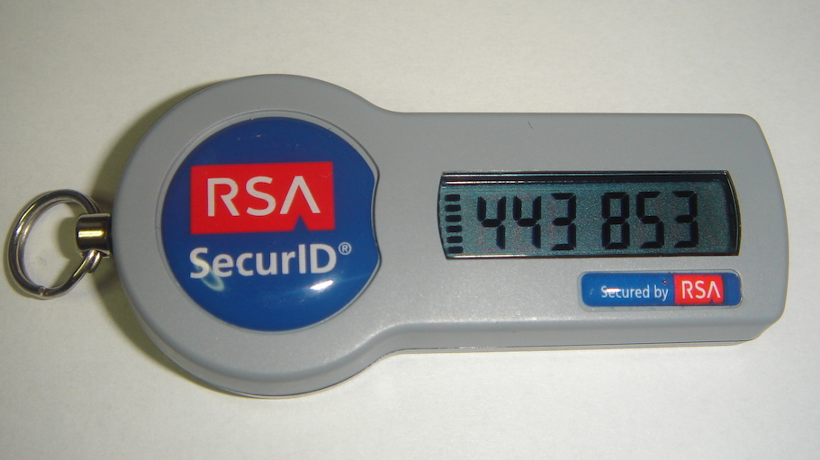
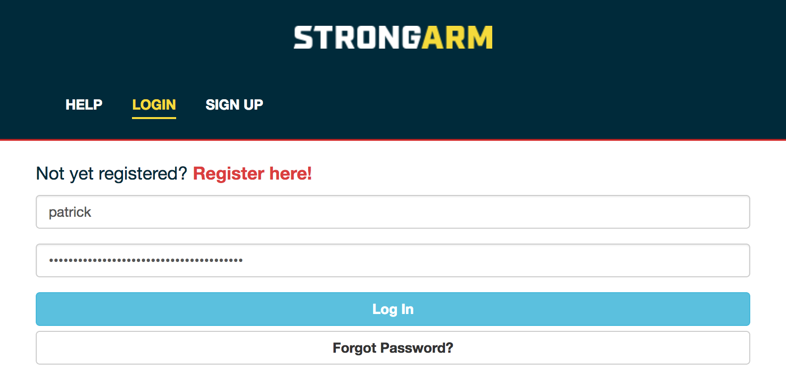

Adding Two-Factor Authentication to Django
##########################################

Django Boston

October 21, 2016

Patrick Cloke

Who am I?
=========

Patrick Cloke

* Lead Software Engineer @ Percipient Networks working on `Strongarm <https://strongarm.io>`_
* `Mozillian <https://mozillians.org/u/clokep/>`_
* `github.com/clokep <https://github.com/clokep>`_
* `@clokep on Twitter <https://twitter.com/clokep>`_
* `patrick@cloke.us <mailto:patrick@cloke.us>`_

django-allauth-2fa
==================

* Why django-allauth-2fa?
* What is two-factor authentication?
* What is django-allauth-2fa?
* Configuring django-allauth-2fa
* How you can help

django + allauth + two-factor authentication
============================================

* What is two-factor authentication?
* Why django-allauth-2fa?
* What is django-allauth-2fa?
* Configuring django-allauth-2fa
* How you can help

Two-factor (multi-factor) authentication [#]_ [#]_
==================================================

Two-factor / mutli-factor / 2FA:
    Requiring a login to have multiple pieces of evidence that a user owns an
    account.

Pieces of evidence are considered two of:

1. Knowledge (something the user knows): e.g. a password, passphrase, PIN.
2. Possession (something the user has): e.g. RSA SecureID, mobile devices / soft
   token, smart cards.
3. Inherence (something the user is): e.g. biometrics: fingerprint, retina, or
   voice.

.. [#] `Multi-factor authentication <https://en.wikipedia.org/wiki/Multi-factor_authentication>`_ on Wikipedia
.. [#] `SecureID token new.JPG <https://commons.wikimedia.org/wiki/File:SecureID_token_new.JPG>`_ on Wikimedia Commons, released into Public Domain

Two-factor (multi-factor) authentication (2) [#]_
=================================================

Generally the second factor is now a user's phone via one of two mechanisms:

* TOTP (Time-based One-Time Password Algorithm), e.g. Google Authenticator,
  Microsoft Authenticator, Facebook Code Generator, etc. See :rfc:`6238` for the
  exact specification.
* SMS / Text message

.. warning::

    Using a mobile phone that shows SMS messages on the lock screen can allow
    easy bypassing of two-factor authentication. Additionally, using a mobile
    phone that receives emails (i.e. password reset emails) as the "second"
    factor essentially recombines the two-factors back to a single factor.

.. [#] `Time-based One-time Password Algorithm <https://en.wikipedia.org/wiki/Time-based_One-time_Password_Algorithm>`_ on Wikipedia

Why Django?
===========

I assume you know what Django is...but just a few reasons we love it:

* "Batteries included"
* Django is extremely flexible!
* Tons of great reusable packages from the Django community!
* ...lots of other reasons... [#]_

.. [#] `Why Django? <https://www.djangoproject.com/start/overview/>`_

django-allauth
==============

Package to work with authentication, registration, account management, and
social authentication. [#]_

* Supports both local (i.e. ``django.contrib.auth``) and "social" accounts (e.g.
  OpenID, OAuth, OAuth2 providers)
* Pluggable (you can add custom providers)
* Supports authentication by multiple forms
* Supports multiple options for account verification

.. [#] `Welcome to django-allauth: Rationale <https://django-allauth.readthedocs.io>`_

django-allauth-2fa [#]_
=======================

A reusable package that adds two-factor authentication to django-allauth.

* Views and middleware to modify the login process:

  1. A user enters their username/password, like normal.
  2. The user is prompted for their two-factor token.
  3. The user is logged in!

* Views for enabling/disabling two-factor authentication.
* (Currently) Supports TOTP devices via QR code for use with a mobile phone
  (e.g. Google Authenticator, Microsoft Authenticator).
* Support for "backup" codes.

.. [#] `django-allauth-2fa <https://github.com/percipient/django-allauth-2fa>`_

Example Workflow (1/2): Normal Login
====================================

User's are given the normal login-prompt (username/email & password).

Example Workflow (2/2): 2FA Token
=================================

User's are then prompted for a 2FA token.

.. image:: login-2.png

How do I set it up?
===================

Collaborators Wanted
====================

* More testing needed (different configurations, interaction with social accounts)
* Support for more device types (e.g. HOTP, YubiKey)
* Support for multiple devices
* Improving the documentation (e.g. add a quickstart document)
* Any other feedback you might have!

https://github.com/percipient/django-allauth-2fa/

Thank You!
==========

Please reach out if you have any questions!

Patrick Cloke

`patrick@strongarm.io <patrick@strongarm.io>`_

Additionally, we're hiring!

https://strongarm.io/careers/
