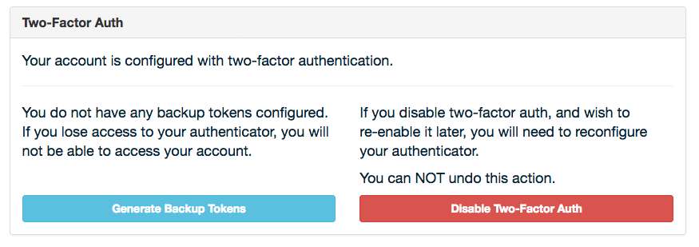

Adding Two-Factor Authentication to Django
##########################################

Django Boston

October 21, 2016

Patrick Cloke

Who am I?
=========

.. image:: clokep.jpg
    :align: right
    :scale: 50%

Patrick Cloke

* Lead Software Engineer @ Percipient Networks working on `Strongarm <https://strongarm.io>`_
* `Mozillian <https://mozillians.org/u/clokep/>`_
* `github.com/clokep <https://github.com/clokep>`_
* `@clokep on Twitter <https://twitter.com/clokep>`_
* `patrick@cloke.us <mailto:patrick@cloke.us>`_

django-allauth-2fa
==================

* Why django-allauth-2fa?
* What is two-factor authentication?
* What is django-allauth-2fa?
* Configuring django-allauth-2fa
* How you can help

django + allauth + two-factor authentication
============================================

* Why django-allauth-2fa?
* What is two-factor authentication?
* What is django-allauth-2fa?
* Configuring django-allauth-2fa
* How you can help

Two-factor (multi-factor) authentication [#]_ [#]_
==================================================

.. figure:: SecureID_token_new.JPG
    :class: align-right
    :scale: 40%

Two-factor / mutli-factor / 2FA:
    Requiring a login to have multiple pieces of evidence that a user owns an
    account.

Pieces of evidence are considered two of:

1. Knowledge (something the user knows): e.g. a password, passphrase, PIN.
2. Possession (something the user has): e.g. RSA SecureID, mobile devices / soft
   token, smart cards.
3. Inherence (something the user is): e.g. biometrics: fingerprint, retina, or
   voice.

.. [#] `Multi-factor authentication <https://en.wikipedia.org/wiki/Multi-factor_authentication>`_ on Wikipedia
.. [#] `SecureID token new.JPG <https://commons.wikimedia.org/wiki/File:SecureID_token_new.JPG>`_ on Wikimedia Commons, released into Public Domain

Two-factor (multi-factor) authentication (2) [#]_
=================================================

Generally the second factor is now a user's phone via one of two mechanisms:

* TOTP (Time-based One-Time Password Algorithm), e.g. Google Authenticator,
  Microsoft Authenticator, Facebook Code Generator, etc. See :rfc:`6238` for the
  exact specification.
* SMS / Text message

.. warning::

    * Showing SMS messages on the lock screen of mobile phones allows easy
      bypassing of two-factor authentication.
    * Receiving emails (i.e. password reset emails) on your mobile phone
      essentially recombines the two-factors back to a single factor.

.. [#] `Time-based One-time Password Algorithm <https://en.wikipedia.org/wiki/Time-based_One-time_Password_Algorithm>`_ on Wikipedia

Why Django?
===========

I assume you know what Django is...but just a few reasons we love it:

* "Batteries included"
* Django is extremely flexible!
* Tons of great reusable packages from the Django community!
* ...lots of other reasons... [#]_

.. [#] `Why Django? <https://www.djangoproject.com/start/overview/>`_

django-allauth
==============

Package to work with authentication, registration, account management, and
social authentication. [#]_

* Supports both local (i.e. ``django.contrib.auth``) and "social" accounts (e.g.
  OpenID, OAuth, OAuth2 providers)
* Pluggable (you can add custom providers)
* Supports authentication by multiple forms
* Supports multiple options for account verification

.. [#] `Welcome to django-allauth: Rationale <https://django-allauth.readthedocs.io>`_

django-allauth-2fa [#]_
=======================

A reusable package that adds two-factor authentication to ``django-allauth``. It
provides the glue between ``django-otp`` [#]_ and ``django-allauth``.

* Views and middleware to modify the login workflow.
* Views for enabling/disabling two-factor authentication.
* Support for "backup" codes.
* Works with Django 1.8, 1.9, 1.10, and ``master``.

.. [#] `django-allauth-2fa <https://github.com/percipient/django-allauth-2fa>`_
.. [#] `django-otp <https://bitbucket.org/psagers/django-otp/>`_

Example Workflow (1/2): User login
==================================

A user enters their username & password, like normal.

.. image:: login-1.png
    :align: center

Example Workflow (2/2): User login
==================================

The user is prompted for their two-factor token. If successful, they are logged
in as normal!

.. image:: login-2.png
    :align: center

Example Workflow (1/3): Configuring Two-Factor
==============================================

Users are presented with a QR code for enabling two-factor authentication.
This supports TOTP devices which can take a picture of the QR code (e.g. Google
Authenticator, Microsoft Authenticator).

Example Workflow (2/3): Configuring Two-Factor
==============================================

Once a user has two-factor enabled, they can disable it or create backup codes.

Example Workflow (3/3): Configuring Two-Factor
==============================================

If a user has created backup codes, they're disabled to the user. Note that each
backup code can only be used once.

.. image:: setup-3.png
    :align: center

How do I set it up? (1/6)
=========================

Install the package via pip [#]_.

.. code-block:: bash

    pip install django-allauth-2fa

.. [#] Ideally you're using a |virtualenv|_! But that could be an entire other
       lightning talk.

.. |virtualenv| replace:: ``virtualenv``
.. _virtualenv: https://virtualenv.pypa.io/en/stable/

How do I set it up? (2/6)
=========================

* Add ``django-allauth-2fa`` to the list of installed apps in ``settings.py``.
* (Also add ``django-allauth``, ``django-otp``, and their dependencies.)

.. code-block:: python
    :linenos:
    :emphasize-lines: 11

    INSTALLED_APPS = (
        'django.contrib.sites',  # Required by allauth.
        'django.contrib.auth',  # Configure Django auth package.
        'django.contrib.contenttypes',
        'django.contrib.sessions',
        'allauth',  # Enable allauth.
        'allauth.account',
        'django_otp',  # Configure the django-otp package.
        'django_otp.plugins.otp_totp',
        'django_otp.plugins.otp_static',
        'allauth_2fa',  # Enable two-factor auth.
    )

How do I set it up? (3/6)
=========================

Enable the ``django-allauth-2fa`` middleware in ``settings.py``. [#]_

.. code-block:: python
    :linenos:
    :emphasize-lines: 9-12

    MIDDLEWARE_CLASSES = (
        # Configure Django auth package.
        'django.contrib.auth.middleware.AuthenticationMiddleware',

        # Configure the django-otp package. Note this must be after the
        # AuthenticationMiddleware.
        'django_otp.middleware.OTPMiddleware',

        # Reset login flow middleware. If this middleware is included, the login
        # flow is reset if another page is loaded between login and successfully
        # entering two-factor credentials.
        'allauth_2fa.middleware.AllauthTwoFactorMiddleware',
    )

.. [#] ``django-allauth-2fa`` also supports the ``MIDDLEWARE`` setting from
       Django>=1.10 as of `two days ago <https://github.com/percipient/django-allauth-2fa/pull/33>`_.

How do I set it up? (4/6)
=========================

Configure ``django-allauth`` to use the ``django-allauth-2fa`` adapter in
``settings.py``. This enables the two-factor authentication login workflow.

.. code-block:: python
    :linenos:
    :emphasize-lines: 1-2

    # Set the allauth adapter to be the 2FA adapter.
    ACCOUNT_ADAPTER = 'allauth_2fa.adapter.OTPAdapter'

    # Configure your default site. See
    # https://docs.djangoproject.com/en/dev/ref/settings/#sites.
    SITE_ID = 1

How do I set it up? (5/6)
=========================

* Add the ``django-allauth-2fa`` URLS to a ``urls.py`` file.
* Suggest doing it next to the allauth URLs.

.. code-block:: python
    :linenos:
    :emphasize-lines: 5

    from django.conf.urls import include, url

    urlpatterns = [
        # Include the allauth and 2FA urls from their respective packages.
        url(r'^', include('allauth_2fa.urls')),
        url(r'^', include('allauth.urls')),
    ]

How do I set it up? (6/6)
=========================

* You'll need to migrate your models before using ``django-allauth-2fa``.
*  ``django-allauth-2fa`` doesn't include models or migrations, but
   ``django-allauth`` and ``django-otp`` do.

.. code-block:: bash
    :linenos:

    python manage.py migrate

Collaborators Wanted
====================

* More testing needed (different configurations, interaction with social accounts)
* Support for more device types (e.g. HOTP, YubiKey, Twilio)
* Support for multiple devices per user
* Improving the documentation (e.g. add a quickstart document)
* Setting up and adding translations
* Any other feedback you might have!

https://github.com/percipient/django-allauth-2fa/
https://pypi.python.org/pypi/django-allauth-2fa/

Thank You!
==========

Please reach out if you have any questions!

Patrick Cloke

`patrick@strongarm.io <patrick@strongarm.io>`_

Additionally, we're hiring!

https://strongarm.io/careers/
