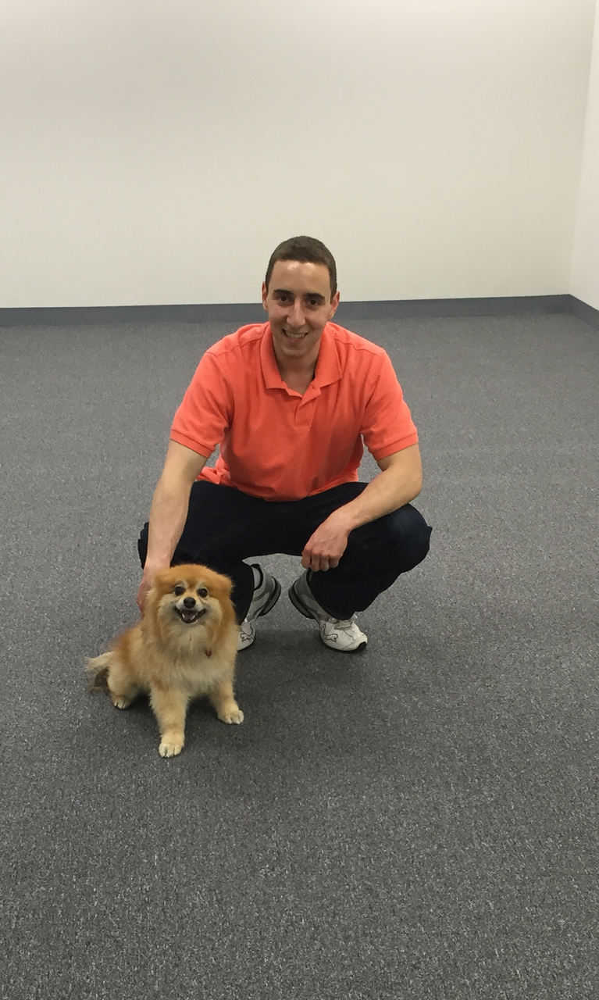

<!---
This is a comment and should not render!
-->

# onboarding engineers
## _5 tips in 5 minutes_

---

# introduction

---

# [fit] Stephen DiCato

## _co-founder & VP, engineering_
## _@ Percipient Networks_
## _github.com/dicato_

---

## 1. Set Goals

---

> working dev env in an hour?

> contribute (patch, pr) on first day?

---

## 2. Document important stuff

---

### *accounts*: GitHub, Slack, Trello
### *host setup*: brew, git, virtualenv
### *developer guide*: conventions, process

---

## 3. Divide & Conquer

---

### *1-on-1* pairing
### *dedicated* time

---

## 4. Package your stuff

---

### vagrant
### docker
### GitHub's Boxen
### `setup.py`

---

## 5. Focus on tooling

---

* `fab dev provision`
* `fab staging deploy`

**focus on hiding the rough edges**

---

### **Bonus:** Checkout Kate Heddleston's blog & Fog Creek interview

---

> I always tell beginners, “If you come across an issue, research it for an hour and then come talk to me.”

https://kateheddleston.com/blog

---

## thank you
## github.com/percipient/talks

stephen@percipientnetworks.com
twitter: @stephendicato
