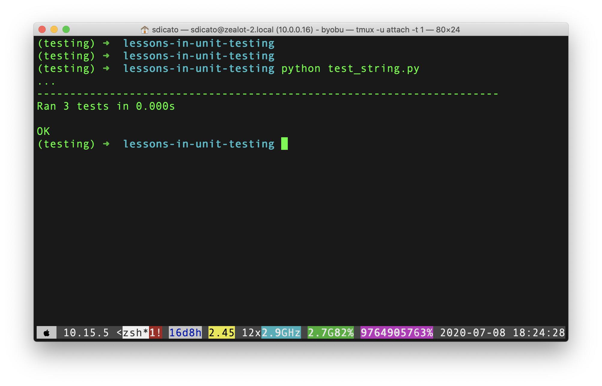
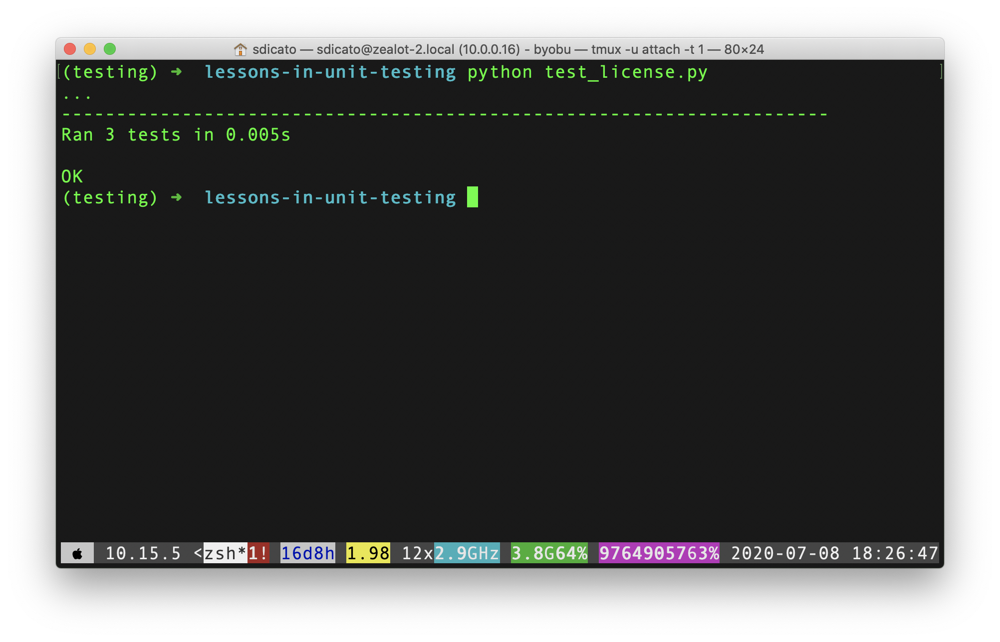
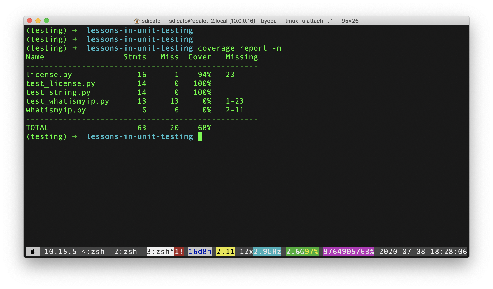
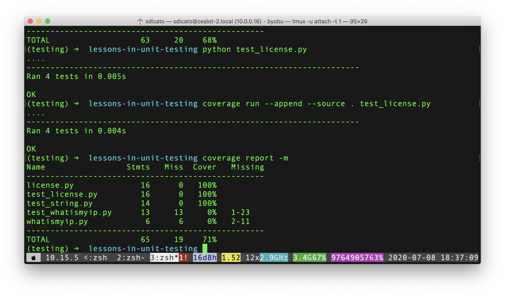
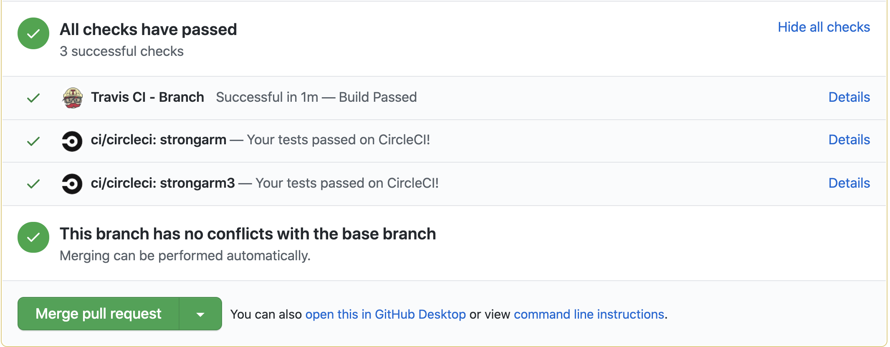

slidenumbers: true

# Lessons in Unit Testing
Stephen DiCato

---

## What is a unit test?

---

An *automated* test of some piece of code; a function, interface, class...
(Smaller unit == better, in general)

---

## Why test the software you write?

---

1) Ensure it does what you want - it works

---

1) Ensure it does what you want - it works
2) Don't break stuff on your customers or colleagues

---

1) Ensure it does what you want - it works
2) Don't break stuff on your customers or colleagues
3) Save time

---

Python (or `$LANG_OF_CHOICE`) must have some libraries to help us...

**Batteries included**, right?

----

Python includes the `unittest` package.

* test fixture
* test case
* test suite
* test runner

([unittest docs](https://docs.python.org/2/library/unittest.html))

----

From the `unittest` docs:

```python
import unittest

class TestStringMethods(unittest.TestCase):

    def test_upper(self):
        self.assertEqual('foo'.upper(), 'FOO')

    def test_isupper(self):
        self.assertTrue('FOO'.isupper())
        self.assertFalse('Foo'.isupper())

    def test_split(self):
        s = 'hello world'
        self.assertEqual(s.split(), ['hello', 'world'])
        # check that s.split fails when the separator is not a string
        with self.assertRaises(TypeError):
            s.split(2)

if __name__ == '__main__':
    unittest.main()
```

----

## Let's run it...

----



----

## Let's look at some DNSWatch code...

----

```python
def is_license_expired(dt_string):
    """
    Verify the datetime string to ensure that it has not expired.
    Returns True if the license has expired.
    """
    # Some licenses never expire.
    if dt_string == 'never' or dt_string == '0':
        return False

    # Dates can be in two formats - "Aug-07-2017" or "07-Aug-2017"
    for dt_format in ('%b-%d-%Y', '%d-%b-%Y'):
        try:
            dt = datetime.strptime(dt_string, dt_format)
            break
        except ValueError:
            pass
    else:
        return True

    # Set datetime to end of day 23:59:59
    dt = dt.replace(hour=23, minute=59, second=59, microsecond=999999, tzinfo=pytz.UTC)

    # Compare to now to determine if license has expired
    if datetime.now(pytz.UTC) > dt:
        return True

    # License has not expired
    return False

```

----

## Let's test it...

----

1) Ensure "special" licenses are *not* expired.

----

1) Ensure "special" licenses are *not* expired.
2) Ensure a license with an expiration date "in the past" *is* expired.

----

1) Ensure "special" licenses are *not* expired.
2) Ensure a license with an expiration date "in the past" *is* expired.
3) Ensure a license with an expiration date "in the future" *is not* expired.

----

```python

class LicenseTests(unittest.TestCase):

    def test_special_licenses(self):
        # Some licenses never expire
        self.assertFalse(is_license_expired('never'))
        self.assertFalse(is_license_expired('0'))

    def test_expired_license(self):
        # Expired
        self.assertTrue(is_license_expired('Aug-07-2017'))
        self.assertTrue(is_license_expired('07-Aug-2017'))

    def test_not_expired_license(self):
        # Not expired
        self.assertFalse(is_license_expired('Aug-07-2099'))
        self.assertFalse(is_license_expired('07-Aug-2099'))
```

----



----

## What about test coverage?

----

`pip install coverage`

----

Before:

```bash
python test_string.py
```

After:

```bash
coverage run --append --source . test_string.py
```

----

## Let's check the coverage of our tests


----



----

**Wait!** - Only 94% coverage?
Let's investigate!

----

Missing statement...

```python
def is_license_expired(date):
    """
    Verify the datetime string to ensure that it has not expired.
    Returns True if the license has expired.
    """
    # Some licenses never expire.
    if date == 'never' or date == '0':
        return False

    # Dates can be in two formats - "Aug-07-2017" or "07-Aug-2017"
    for date_format in ('%b-%d-%Y', '%d-%b-%Y'):
        try:
            dt = datetime.strptime(date, date_format)
            break
        except ValueError:
            pass
    else:
        return True      <-------- MISSING COVERAGE!

    .
    .
    .
```

Let's add a test for invalid date format...

----

```python
def test_invalid_format(self):
    # Invalid format with the year first
    self.assertTrue(is_license_expired('2020-Jul-9'))
```




----

Tracking coverage over time is a *reasonable* metric

Have your CI or build tools do it for you!

----

## How about a more advanced topic?

----

## **Mocking**

----

*Question* - How do you test your code when it has an external dependency?

----

## Let's look at a naive example...

----

A trivial *"What is my IP?"*

```python
# Ahem, you should use requests...
import urllib


def get_external_address():
    url = 'https://dnswatch.watchguard.com/whatismyip/'
    return urllib.urlopen(url).read()


if __name__ == '__main__':
    print get_external_address()

```

----

We want to test this, but don't want to depend on:

1) the local network
2) the availability of the external service

...we only want to test our code.

----

`pip install mock`
(included in Python 3)

----

```python
from StringIO import StringIO
import unittest

import mock

from whatismyip import get_external_address


class ExternalAddressTests(unittest.TestCase):
    def test_get_address(self):
        with mock.patch('urllib.urlopen') as urlopen:
            fake_ip = StringIO('12.12.12.12')
            urlopen.return_value = fake_ip

            self.assertEqual(get_external_address(), '12.12.12.12')

            urlopen.assert_called_with(
                'https://dnswatch.watchguard.com/whatismyip/'
            )


if __name__ == '__main__':
    unittest.main()
```

----

*Mock* is very powerful...

----

## DNSWatch Codebase

- One repository
- CVS --> SVN --> Git (today)
- Trac --> MediaWiki? --> GitHub (today)
- Tests are run continuously via CircleCI*

(...and TravisCI; more on that in a minute)

----



----

## Some "Rules"

----

## Rules
1. Don't merge new code without tests

----

## Rules

1. Don't merge new code without tests
2. *Aim* to add tests to older code lacking coverage

----

## Rules

1. Don't merge new code without tests
2. *Aim* to add tests to older code lacking coverage
3. Don't merge code with breaking tests

----

## The **GO** Client

----

* Runs on Windows
* Python (*surprise!*)
* Heavy use of `WMI` and `Twisted`

---

**Goal** - *parity* between environments
(Run the tests on the same platform as production, or in this case a customer computer)

----

## TravisCI supports Windows

```yaml
os: windows
language: bash
install:
  - choco install python2 --x86 -fy
  - export PATH=/c/Python27:/c/Python27/Scripts:$PATH;
  # Pip 19.0 breaks installing PyInstaller: https://github.com/pypa/pip/issues/6163
  - python -m pip install --upgrade "pip<19"
  - pip install -r agent/requirements-dev.txt
  - pip install -e agent

script:
  - python -m nose agent
```

----

* Testing
* Test Coverage
* Mocking
* Building the practice

## Want more?

----

# Resources

* [Obey the Testing Goat!](https://www.obeythetestinggoat.com/) (free online!)
* [Python 3 `unittest` docs](https://docs.python.org/3/library/unittest.html)
* [Ned Batchelder's posts on testing](https://nedbatchelder.com/)
